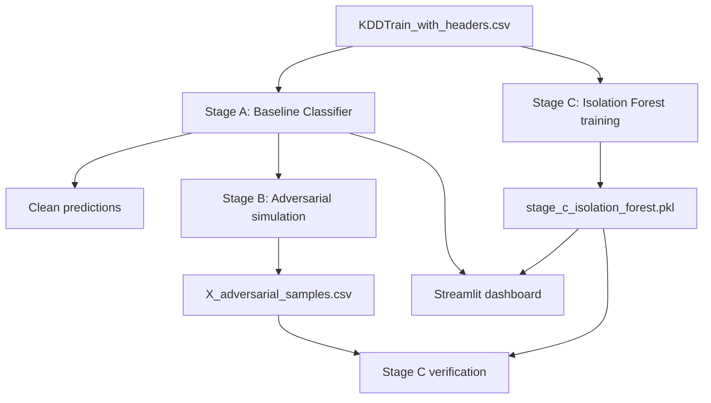

# NetReaper Project Explanation

NetReaper is a layered intrusion-detection demo built on NSL-KDD. Instead of relying on one model, it combines:

1. A supervised baseline classifier (Stage A)
2. An adversarial robustness simulation (Stage B)
3. An anomaly-detection safety net (Stage C)

The dashboard in [app.py](app.py) visualizes how performance changes from clean inference to attacked inference and then to the final defensive decision.

## Why this project exists

A model can score well on clean test data and still fail under manipulated input. NetReaper demonstrates that failure mode and then mitigates it with a second detector that looks for abnormal behavior.

Core idea:
- Stage A gives predictive accuracy on known labels.
- Stage B stresses Stage A with perturbations.
- Stage C catches suspicious patterns even when Stage A is degraded.

## High-level data flow



## File responsibilities

- [stage_a_baseline.py](stage_a_baseline.py)
  - preprocessing
  - train/test split
  - baseline model training (RF/XGB)
  - baseline evaluation and artifacts

- [attack_simulation.py](attack_simulation.py)
  - adversarial perturbation simulation logic
  - robustness metrics definitions

- [run_stage_b_attack.py](run_stage_b_attack.py)
  - runnable Stage B entry point for dummy and real-data modes
  - exports adversarial samples

- [stage_c_anomaly.py](stage_c_anomaly.py)
  - trains Isolation Forest on normal traffic
  - saves anomaly model and SHAP summary artifact

- [stage_c_test.py](stage_c_test.py)
  - verifies anomaly detection on adversarial samples

- [app.py](app.py)
  - interactive end-to-end demo UI using Stage A + Stage C outputs

- [final_pipeline.py](final_pipeline.py)
  - integrated script that runs a complete combined pipeline

## Stage details

## Stage A (baseline classifier)

Input: [KDDTrain_with_headers.csv](KDDTrain_with_headers.csv)

Label mapping:
- `normal` -> `0`
- all attack labels -> `1`

Main outputs:
- baseline metrics (accuracy, precision, recall, F1, ROC-AUC)
- classifier artifacts for downstream use

Role in system:
- provides the primary predictive signal
- serves as the reference point for robustness testing

## Stage B (attack simulation)

Stage B perturbs feature vectors and compares clean vs attacked performance.

Main outputs:
- adversarial accuracy and accuracy drop
- attack success metrics
- [X_adversarial_samples.csv](X_adversarial_samples.csv)

Role in system:
- quantifies how fragile Stage A is under perturbation
- provides adversarial samples for Stage C verification

## Stage C (anomaly safety net)

Stage C uses Isolation Forest trained on normal-only behavior.

Anomaly conventions:
- `-1` = anomaly
- `1` = normal

Main outputs:
- [stage_c_isolation_forest.pkl](stage_c_isolation_forest.pkl)
- [stage_c_shap_summary.png](stage_c_shap_summary.png)

Role in system:
- adds defense when supervised predictions are unstable
- flags structurally abnormal samples independent of class labels

## Final integration logic

Defensive decision rule:
- classify as attack if `(clf_pred == 1) OR (anomaly_pred == -1)`

This is intentionally conservative and favors catching suspicious traffic.

## Streamlit app (current implementation)

The dashboard in [app.py](app.py) was updated with a performance and UX refactor.

Implemented improvements:
- Cached loading/training flow to reduce rerun overhead
  - dataset cache
  - final output cache
  - model/training artifact cache
  - isolation model cache
- Unified attack branch (duplicate attack logic removed)
- Tabbed layout:
  - Dashboard
  - Detailed Analysis
  - Raw Data
- KPI cards with deltas:
  - attack impact delta
  - recovery delta
- Distribution chart and confusion matrices grouped by stage

Why this matters:
- lower interaction latency in Streamlit reruns
- clearer side-by-side comparison of Stage A, attacked, and final outputs
- easier operational interpretation through deltas

## How to run

Install dependencies:

```bash
python -m pip install -r requirements.txt
```

Run stages:

```bash
python stage_a_baseline.py
python run_stage_b_attack.py --real-data --csv-path KDDTrain_with_headers.csv --model-type rf
python stage_c_anomaly.py
python stage_c_test.py
```

Launch dashboard:

```bash
streamlit run app.py
```

## Current caveats

- This repository is demo/prototype oriented, not production hardened.
- Some scripts may overlap in functionality (stage scripts vs integrated pipeline script).
- Stage B and dashboard perturbation behavior can differ by implementation path, so metric parity across all scripts is not guaranteed.

## Suggested reading order

1. [README.md](README.md)
2. [stage_a_baseline.py](stage_a_baseline.py)
3. [attack_simulation.py](attack_simulation.py)
4. [run_stage_b_attack.py](run_stage_b_attack.py)
5. [stage_c_anomaly.py](stage_c_anomaly.py)
6. [stage_c_test.py](stage_c_test.py)
7. [app.py](app.py)
8. [final_pipeline.py](final_pipeline.py)

## Summary

NetReaper demonstrates a practical security pattern: combine a strong baseline model with a behavior-based safety net, then evaluate the combined system under adversarial pressure. The latest UI updates make that story faster to run and easier to interpret.