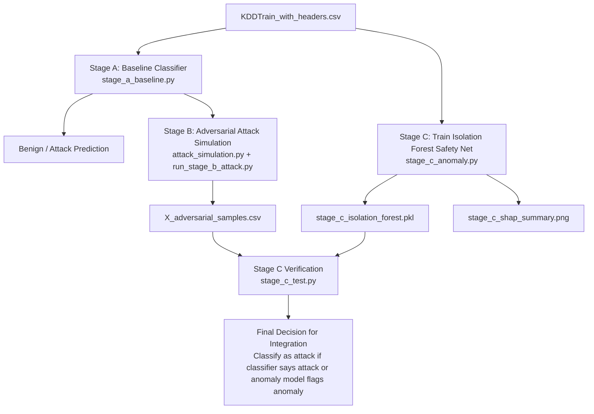

# Netreaper - ML Security Hackathon Project

Adversarial-resilient intrusion detection on NSL-KDD.

## Flowchart



## Project Scope

- Stage A: Binary intrusion classification baseline (`stage_a_baseline.py`)
- Stage B: Adversarial attack simulation (`attack_simulation.py`, `run_stage_b_attack.py`)
- Stage C: Anomaly detection safety net (`stage_c_anomaly.py`, `stage_c_test.py`)
- Demo UI: Streamlit app (`app.py`)

## Dataset

- File: `KDDTrain_with_headers.csv`
- Target column: `label`
- Stage A binary mapping:
	- `normal` -> `0`
	- all attack labels -> `1`

## Setup

```bash
python -m pip install -r requirements.txt
```

## Run Guide

### Stage A - Baseline classification

```bash
python stage_a_baseline.py
```

Outputs include:
- Accuracy, Precision, Recall, F1, ROC-AUC
- Confusion matrix and ROC plots
- Feature importance plots

### Stage B - Adversarial attack simulation

Dummy mode:

```bash
python run_stage_b_attack.py
```

Real-data mode:

```bash
python run_stage_b_attack.py --real-data --csv-path KDDTrain_with_headers.csv --model-type rf
```

Optional model type values:
- `rf`
- `xgb`

Outputs include:
- Clean vs adversarial accuracy
- Accuracy drop and attack success rate
- Average L2 and L-infinity perturbation

### Stage C - Isolation Forest anomaly safety net

Train Stage C model + SHAP explanation plot:

```bash
python stage_c_anomaly.py
```

Test adversarial detection using Stage B outputs:

```bash
python stage_c_test.py
```

Generated artifacts:
- `stage_c_isolation_forest.pkl`
- `stage_c_shap_summary.png`

### Streamlit demo app

```bash
streamlit run app.py
```

## Integration Contract

- Stage C anomaly convention:
	- `-1` = anomaly
	- `1` = normal
- Team integration rule:
	- `(clf_pred == 1) OR (anomaly_pred == -1)`

See `handover.md` and `context.md` for teammate handoff details.

