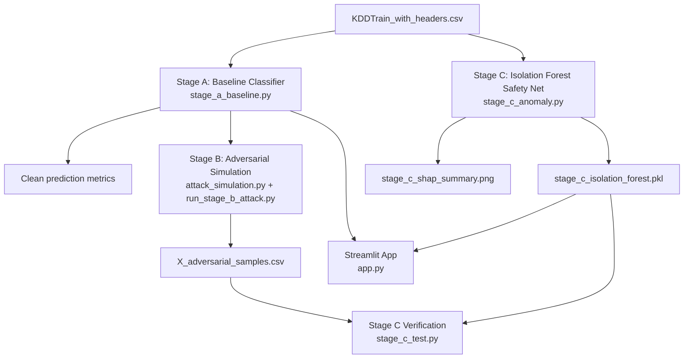

# NetReaper - ML Security Hackathon Project

Adversarial-resilient intrusion detection on NSL-KDD using a 3-stage pipeline plus an interactive Streamlit dashboard.

## Architecture



## Project Scope

- Stage A: Binary intrusion classification baseline ([stage_a_baseline.py](stage_a_baseline.py))
- Stage B: Adversarial attack simulation ([attack_simulation.py](attack_simulation.py), [run_stage_b_attack.py](run_stage_b_attack.py))
- Stage C: Anomaly safety net ([stage_c_anomaly.py](stage_c_anomaly.py), [stage_c_test.py](stage_c_test.py))
- Dashboard: Streamlit UI ([app.py](app.py))

## Dataset

- File: [KDDTrain_with_headers.csv](KDDTrain_with_headers.csv)
- Target column: `label`
- Binary mapping used by Stage A:
	- `normal` -> `0`
	- all attack labels -> `1`

## Setup

```bash
python -m pip install -r requirements.txt
```

Windows PowerShell with local venv:

```powershell
.\.venv\Scripts\activate
pip install -r .\requirements.txt
```

## Run Guide

### 1) Stage A - Baseline classification

```bash
python stage_a_baseline.py
```

Typical outputs include accuracy metrics, confusion matrix, ROC curve, and feature-importance charts.

### 2) Stage B - Adversarial simulation

Dummy mode:

```bash
python run_stage_b_attack.py
```

Real-data mode:

```bash
python run_stage_b_attack.py --real-data --csv-path KDDTrain_with_headers.csv --model-type rf
```

Model options: `rf`, `xgb`

### 3) Stage C - Isolation Forest safety net

Train Stage C model and SHAP summary:

```bash
python stage_c_anomaly.py
```

Verify detection on adversarial outputs:

```bash
python stage_c_test.py
```

Artifacts:
- [stage_c_isolation_forest.pkl](stage_c_isolation_forest.pkl)
- [stage_c_shap_summary.png](stage_c_shap_summary.png)

### 4) Streamlit dashboard

```bash
streamlit run app.py
```

## Streamlit Dashboard (Current)

The dashboard now includes:

- Cached data and model artifacts to reduce rerun cost
	- dataset loading cache
	- model/training artifact cache
	- anomaly model cache
- Single, unified adversarial path (duplicate logic removed)
- Tabbed layout
	- Dashboard: KPI cards and prediction distribution
	- Detailed Analysis: confusion matrices for each stage
	- Raw Data: sample predictions and output snapshot
- Metric deltas
	- attack impact delta (After Attack vs Stage A)
	- recovery delta (Final vs attacked/baseline)

## Integration Contract

- Stage C anomaly convention:
	- `-1` = anomaly
	- `1` = normal
- Final defensive decision rule:
	- classify as attack if `(clf_pred == 1) OR (anomaly_pred == -1)`

## Related Docs

- [PROJECT_EXPLANATION.md](PROJECT_EXPLANATION.md): full technical walkthrough
- [context.md](context.md): implementation status notes
- [handover.md](handover.md): teammate handoff and integration details

