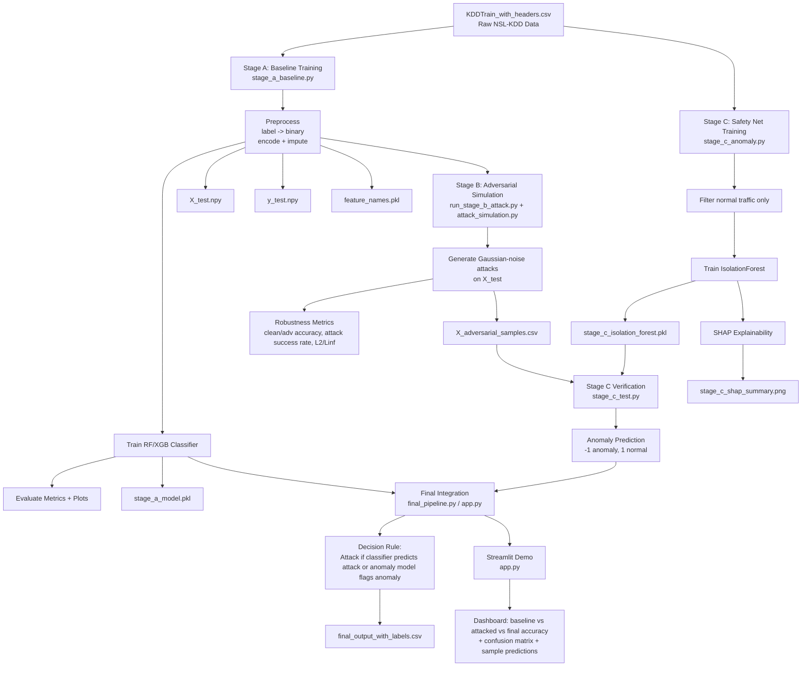

# Netreaper Full Project Flowchart

Use this Mermaid diagram directly in your report.

## Notes for Report

- Stage A is supervised attack classification.
- Stage B stress-tests Stage A with adversarial perturbations.
- Stage C is an unsupervised safety net trained on normal behavior.
- Final system combines Stage A + Stage C for stronger adversarial resilience.